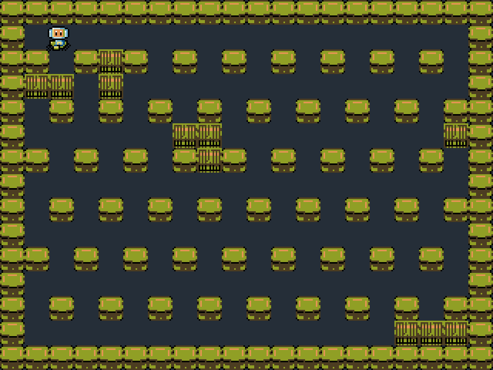
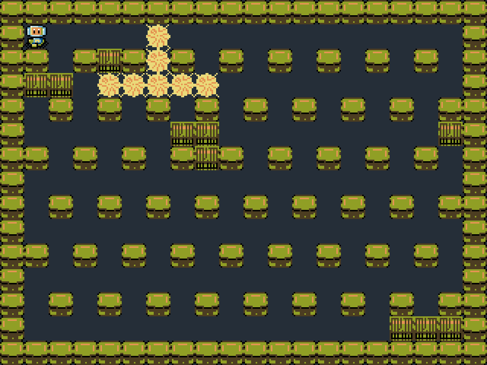

# bman.c16 - Inspired by Hudson Soft's classic Bomberman series.

## Build

Pre-requisites:

- make
- [as16](https://github.com/tykel/as16)
- [img16](https://github.com/tykel/chip16)

Then, run `make` from the directory.

## Run

You will need a Chip16 emulator to run the game.

Either use your own, or one of the available ones.

The most up-to-date emulator is my own [mash16](https://github.com/tykel/mash16).

